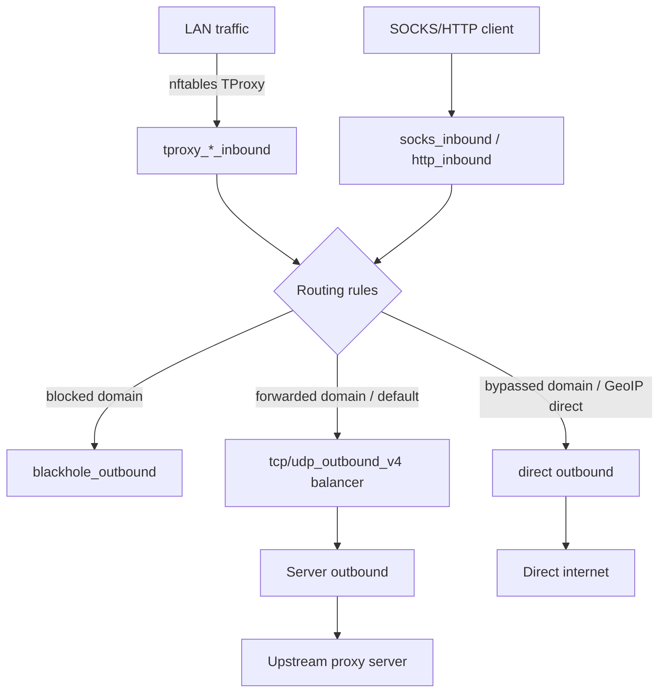

luci-app-xray generates a complete Xray configuration at startup by assembling inbounds, outbounds, routing rules, and balancers from your UCI config. Understanding this pipeline helps you debug routing decisions, add extra listener ports, or redirect specific devices to different upstream servers.

## Built-in inbounds

The config generator in `gen_config.uc` always creates the following inbounds. Ports are the defaults; you can override most of them with the corresponding UCI option on the `general` section.

<AccordionGroup>
  <Accordion title="SOCKS5 and HTTP proxy inbounds">

| Tag | Default port | Protocol | UCI override |
|-----|-------------|----------|--------------|
| `socks_inbound` | 1080 | SOCKS5 | `socks_port` |
| `http_inbound` | 1081 | HTTP | `http_port` |

These are plain proxy inbounds, not TProxy. They are useful for configuring individual applications to send traffic through Xray explicitly.

  </Accordion>
  <Accordion title="TProxy inbounds">

| Tag | Default port | Network | UCI override |
|-----|-------------|---------|--------------|
| `tproxy_tcp_inbound_v4` | 1082 | TCP | `tproxy_port_tcp_v4` |
| `tproxy_tcp_inbound_v6` | 1083 | TCP | `tproxy_port_tcp_v6` |
| `tproxy_udp_inbound_v4` | 1084 | UDP | `tproxy_port_udp_v4` |
| `tproxy_udp_inbound_v6` | 1085 | UDP | `tproxy_port_udp_v6` |

These `dokodemo-door` inbounds receive traffic redirected by nftables TProxy rules. IPv4 and IPv6 variants are kept separate so that routing rules can apply different outbound balancers to each.

  </Accordion>
  <Accordion title="FakeDNS TProxy inbounds">

| Tag | Default port | Network | UCI override |
|-----|-------------|---------|--------------|
| `tproxy_tcp_inbound_f4` | 1086 | TCP | `tproxy_port_tcp_f4` |
| `tproxy_tcp_inbound_f6` | 1087 | TCP | `tproxy_port_tcp_f6` |
| `tproxy_udp_inbound_f4` | 1088 | UDP | `tproxy_port_udp_f4` |
| `tproxy_udp_inbound_f6` | 1089 | UDP | `tproxy_port_udp_f6` |

These inbounds receive traffic destined for FakeDNS IP pools (`198.18.0.0/15` for IPv4, `fc00::/18` for IPv6). They have `fakedns` sniffing enabled and `metadataOnly` set to `true`.

  </Accordion>
  <Accordion title="DNS server inbounds">

DNS server inbounds are created starting at `dns_port` (default 5300) up through `dns_port + dns_count` (default: ports 5300–5303). Each is a `dokodemo-door` inbound that forwards DNS queries to the `default_dns` server.

Tag pattern: `dns_server_inbound:<port>`

  </Accordion>
  <Accordion title="Optional inbounds">

| Inbound | Enabled by | Tag | Default port |
|---------|------------|-----|-------------|
| HTTPS | `web_server_enable=1` | `https_inbound` | 443 |
| Metrics | `metrics_server_enable=1` | `metrics` | 18888 |
| API | `xray_api=1` | `api` | 8080 (127.0.0.1 only) |

  </Accordion>
</AccordionGroup>

## Extra inbounds

Extra inbounds let you add additional listener ports beyond the built-in ones. Each is a separate UCI section of type `extra_inbound`.

### Fields

<ParamField path="inbound_type" type="string" required>
  Type of listener to create.

  | Value | Description |
  |-------|-------------|
  | `http` | HTTP proxy |
  | `socks5` | SOCKS5 proxy |
  | `tproxy_tcp` | TProxy TCP (dokodemo-door) |
  | `tproxy_udp` | TProxy UDP (dokodemo-door) |
</ParamField>

<ParamField path="inbound_addr" type="string" default="0.0.0.0">
  Address to listen on.
</ParamField>

<ParamField path="inbound_port" type="number" required>
  Port to listen on.
</ParamField>

<ParamField path="inbound_username" type="string">
  Authentication username. Applies to `http` and `socks5` types only.
</ParamField>

<ParamField path="inbound_password" type="string">
  Authentication password. Applies to `http` and `socks5` types only.
</ParamField>

<ParamField path="specify_outbound" type="boolean" default="0">
  When `1`, traffic from this inbound is routed to the balancer defined by `destination` rather than joining the global balancer pool.
</ParamField>

<ParamField path="destination" type="string[]">
  List of server section names to use as outbound targets. Only used when `specify_outbound=1`.
</ParamField>

<ParamField path="balancer_strategy" type="string" default="random">
  Load balancing strategy for this extra inbound's dedicated balancer. Accepts the same values as `general_balancer_strategy`.
</ParamField>

### Routing behaviour

- When `specify_outbound=0`, traffic from the extra inbound joins the global IPv4 TCP or UDP balancer (depending on inbound type). This is the "global" routing path.
- When `specify_outbound=1`, a dedicated balancer (`extra_inbound_outbound:<name>`) is created for this inbound, and a routing rule directs all traffic from it exclusively to that balancer.

<Note>
  `tproxy_tcp` and `tproxy_udp` extra inbounds inherit sniffing settings from the `general` section (`tproxy_sniffing` and `route_only`). `http` and `socks5` extra inbounds do not perform sniffing.
</Note>

### Example

```text xray_core (UCI)
config extra_inbound 'work_proxy'
    option inbound_type 'socks5'
    option inbound_addr '0.0.0.0'
    option inbound_port '1090'
    option inbound_username 'user'
    option inbound_password 'secret'
    option specify_outbound '1'
    list destination 'my_work_server'
    option balancer_strategy 'random'
```

## Built-in outbounds

The generator always creates the following outbounds regardless of configuration.

| Tag | Protocol | Purpose |
|-----|----------|---------|
| `blackhole_outbound` | blackhole | Drop traffic (used for blocked domains) |
| `direct` | freedom | Send traffic directly, domain strategy `UseIPv4` |
| `dynamic_direct` | freedom | Send directly with mark `0xfc` (252) for dynamic direct cache registration |
| `dns_server_outbound` | dns | Handle DNS server responses, mark `0xfe` (254) |

Server-specific outbounds are generated on demand: one outbound per server referenced by any balancer. If a server has a `dialer_proxy`, a second chained outbound is also created.

## Routing pipeline overview



Traffic flows from nftables TProxy (or explicit SOCKS/HTTP proxy clients) into the inbound layer, through Xray's routing engine, and out through the appropriate outbound. The balancer selects which server outbound to use based on the configured strategy.
